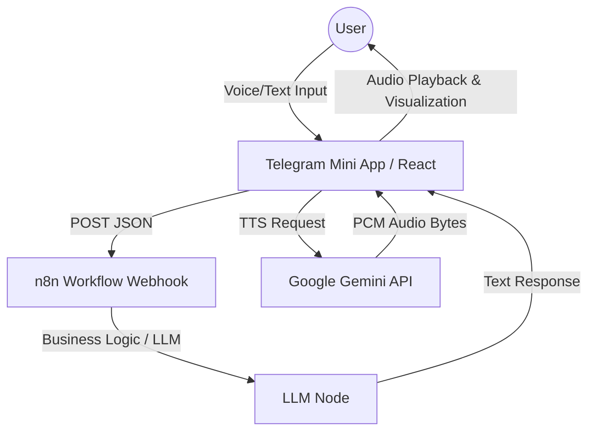

# Техническая документация проекта VoxLux

## 1. Обзор проекта

**VoxLux** — это премиальное Telegram Mini App (TMA), представляющее собой голосового AI-ассистента с эстетикой "Black Minimalist". Приложение обеспечивает естественное взаимодействие с пользователем через голос или текст, используя внешнюю логику (n8n) для генерации ответов и передовые технологии синтеза речи от Google.

### 1.1. Ключевой функционал (Реализовано)

*   **Гибридный ввод:**
    *   **Голос:** Распознавание речи через нативный Web Speech API (STT).
    *   **Текст:** Полноценный UI для ввода текста с валидацией (проверка на наличие кириллицы). Используется нативная кнопка **MainButton** Telegram для отправки сообщения.
*   **Визуализация:** Canvas-визуалайзер, реагирующий на амплитуду звука в реальном времени. Анимация меняется в зависимости от состояния (ожидание, запись, обработка, воспроизведение).
*   **Синтез речи (TTS):** Эксклюзивное использование **Google Gemini TTS** (модель `gemini-2.5-flash-preview-tts`) для озвучивания ответов агента.
*   **Бэкенд-логика:** Интеграция с n8n через Webhook для обработки запросов и формирования ответов.
*   **История чата:** Отображение транскрипции диалога с разделением на сообщения пользователя и агента, а также иконками типа ввода (микрофон/клавиатура).
*   **Telegram Integration:** Использование Telegram WebApp SDK для адаптации интерфейса, получения данных пользователя и тактильной отдачи (Haptic Feedback).

### 1.2. Целевая аудитория
Пользователи Telegram, которым необходим быстрый и удобный голосовой помощник для записи на услуги или получения информации.

---

## 2. Архитектура и Стек технологий

### 2.1. Диаграмма компонентов



### 2.2. Технологический стек

*   **Frontend (Telegram Mini App):**
    *   **Framework:** React 19 (через ES Modules).
    *   **Styling:** Tailwind CSS (через CDN).
    *   **API Client:** `@google/genai` (v1.33.0+).
    *   **Telegram Integration:** Telegram Web Apps JS SDK.
*   **Backend Logic:**
    *   **Automation:** n8n (Webhook workflow).
*   **Speech Services:**
    *   **STT (Speech-to-Text):** Browser Native SpeechRecognition API.
    *   **TTS (Text-to-Speech):** Google Gemini API (`gemini-2.5-flash-preview-tts`).

---

## 3. Подробное описание функционала

### 3.1. Telegram Mini App (Interface)
Приложение является одностраничным (SPA) и полностью соответствует гайдлайнам Telegram Mini Apps.

*   **Native Main Button:** В текстовом режиме вместо HTML-кнопки используется нативная кнопка Telegram (`tg.MainButton`). Она появляется над клавиатурой, когда пользователь начинает вводить текст, что экономит экранное пространство.
*   **Header Colors:** При инициализации приложение принудительно устанавливает цвета шапки и фона Telegram WebApp в черный (`#000000`) через методы `setHeaderColor` и `setBackgroundColor`, обеспечивая бесшовный переход между приложением и интерфейсом мессенджера.
*   **Адаптивность:** Используются переменные CSS Telegram (`var(--tg-content-safe-area-inset-top)`) для корректного отображения на всех устройствах (iPhone c "челкой").
*   **Состояния приложения (`AppState`):**
    *   `IDLE`: Ожидание ввода.
    *   `LISTENING`: Активен микрофон, идет запись.
    *   `PROCESSING`: Запрос отправлен в n8n, ожидание ответа. MainButton показывает спиннер загрузки.
    *   `SPEAKING`: Воспроизведение аудио ответа (TTS).
    *   `ERROR`: Отображение ошибки.

### 3.2. Интеграция с n8n (Backend)
Логика взаимодействия описана в `services/n8nService.ts`.
*   **Метод:** `POST` запрос к вебхуку n8n.
*   **Payload (JSON):**
    ```json
    {
      "userId": "12345678",
      "query": "Текст запроса пользователя",
      "sessionId": "timestamp_session_id",
      "platform": "telegram_mini_app",
      "inputType": "voice" // или "text"
    }
    ```
*   **Обработка ответа:** Ожидается JSON формата `{ "aiResponse": "...", "meta": { "shouldSpeak": true } }`. Реализована защита от сбоев: если n8n вернет 500 ошибку или простой текст, приложение корректно обработает это и уведомит пользователя.

### 3.3. Google Gemini TTS (Синтез речи)
Критически важный компонент, реализованный в `services/voiceService.ts`.

1.  **Вызов API:** Используется клиент `@google/genai`.
2.  **Модель:** `gemini-2.5-flash-preview-tts`.
3.  **Параметры голоса:** В конфигурации задан голос `Kore` (или `Zephyr`).
4.  **Декодирование аудио:**
    API возвращает сырые PCM данные (без заголовков WAV). Frontend декодирует их вручную:
    *   Base64 -> Uint8Array -> Int16Array -> Float32Array (нормализация для Web Audio API).
    *   Частота дискретизации: **24000 Гц**.

Пример кода вызова (из `voiceService.ts`):
```typescript
const response = await this.ai.models.generateContent({
  model: "gemini-2.5-flash-preview-tts",
  contents: [{ parts: [{ text }] }],
  config: {
    responseModalities: [Modality.AUDIO],
    speechConfig: {
        voiceConfig: { prebuiltVoiceConfig: { voiceName: 'Kore' } },
    },
  },
});
```

---

## 4. Инструкция по развертыванию и запуску

### 4.1. Предварительные требования
*   API Key от Google Cloud с доступом к Gemini API.
*   Настроенный и активный Workflow в n8n (Webhook node).
*   Telegram Bot Token.

### 4.2. Локальная разработка
Поскольку проект использует прямые ES-модули (без сборщика типа Webpack/Vite в текущей конфигурации для простоты), его можно запустить любым статическим сервером, но для React-разработки рекомендуется использовать Vite.

1.  **Создание `.env` файла:**
    В корне проекта создайте файл `.env`. *Примечание: В текущей версии для браузера переменные подставляются бандлером или прописаны в коде. Убедитесь, что ваш API Key доступен.*
    ```env
    API_KEY=AIzaSy...YOUR_GEMINI_KEY
    ```

2.  **Запуск:**
    Если используется Vite (рекомендуется для DX):
    ```bash
    npm install
    npm run dev
    ```

### 4.3. Настройка Telegram
1.  Создайте бота через **@BotFather**.
2.  Настройте **Menu Button**:
    *   Команда `/mybots` -> Выберите бота -> `Bot Settings` -> `Menu Button` -> `Configure Menu Button`.
    *   Отправьте URL вашего веб-приложения (обязательно HTTPS).

### 4.4. Продакшн деплой
Рекомендуется использовать Vercel или Netlify.
1.  Загрузите код в репозиторий.
2.  Настройте переменные окружения (`API_KEY`) в панели хостинга.
3.  Полученный домен укажите в настройках Telegram бота.

---

## 5. Структура проекта

```
/
├── components/
│   ├── Background.tsx    # Анимированный фон (SVG wave)
│   ├── Transcript.tsx    # История сообщений чата
│   └── Visualizer.tsx    # Canvas-анимация аудио
├── services/
│   ├── geminiService.ts  # Логика Gemini Live API (стриминг)
│   ├── n8nService.ts     # HTTP клиент для n8n
│   └── voiceService.ts   # Основной сервис: STT и Gemini TTS
├── server/
│   └── server.js         # Прокси-сервер (Node.js) для скрытия ключей
├── App.tsx               # Корневой компонент и управление состоянием
├── constants.ts          # Константы (URL, промпты, цвета)
├── metadata.json         # Манифест разрешений
├── types.ts              # TypeScript интерфейсы
├── index.html            # HTML шаблон
└── index.tsx             # Точка входа React
```

---

## 6. Руководство разработчика

### 6.1. Добавление нового функционала
1.  **Новый тип ввода:** Добавьте тип в `ChatMessage` (`types.ts`) и обновите `processQuery` в `App.tsx`.
2.  **Изменение голоса:** Отредактируйте `voiceConfig` в `services/voiceService.ts`.

### 6.2. Отладка и Мониторинг
*   **Ошибки TTS:** Логируются в консоль как `Gemini TTS Error`. Если звук не воспроизводится, проверьте квоты API и статус `AudioContext` (браузеры блокируют автовоспроизведение без жеста пользователя).
*   **Ошибки n8n:** Если сервер возвращает 500, приложение использует graceful degradation и озвучивает стандартное сообщение об ошибке.

---

## 7. Безопасность и Производительность

### 7.1. API Keys
*   **Внимание:** В текущей клиентской реализации `API_KEY` для Gemini может быть виден в сетевых запросах.
*   **Рекомендация:** Для продакшена обязательно используйте прокси-сервер (пример в `server/server.js`) или Serverless функции, чтобы делать запросы к Gemini API с сервера, а не из браузера пользователя.

### 7.2. Квоты
Google Gemini API имеет лимиты. Используйте кэширование популярных аудио-ответов (например, приветствия), чтобы сократить количество запросов к API.

---

## 8. Планы по развитию (Roadmap)

1.  **Backend Proxy:** Внедрение обязательного проксирования запросов к n8n и Gemini для безопасности ключей.
2.  **Streaming TTS:** Переход на `generateContentStream` для снижения задержки перед началом речи (Latnecy).
3.  **Voice Activity Detection (VAD):** Улучшение определения окончания речи пользователя для более плавного диалога без нажатия кнопок.
4.  **Мультиязычность:** Добавление поддержки английского языка с переключением в интерфейсе.
---

## 9. История версий и исправлений

### Версия 1.0.3 (15.12.2025)

#### Исправленные ошибки:

1. **Чёрный экран после деплоя** - API ключ Gemini не передавался при сборке:
   - `vite.config.ts`: Добавлен fallback для переменных окружения
   - `workflow`: Добавлена передача секретов `GEMINI_API_KEY` и `API_KEY`

#### Важно - Настройка GitHub Secrets:
Для работы TTS необходимо добавить секрет в репозиторий:
1. Перейдите в **Settings → Secrets and variables → Actions**
2. Нажмите **New repository secret**
3. Name: `GEMINI_API_KEY`
4. Value: Ваш ключ Google Gemini API (начинается с `AIza...`)

### Версия 1.0.2 (15.12.2025)
- Удалены дублирующиеся экспорты в `App.tsx` и `voiceService.ts`
- Добавлен `.nvmrc` с версией Node 20
- Обновлён workflow для сборки с Node 20

### Версия 1.0.1 (15.12.2025)

#### Исправленные ошибки:

1. **voiceService.ts** - Добавлен отсутствующий экспорт экземпляра сервиса:
   ```typescript
   export const voiceService = new VoiceService();
   ```

2. **App.tsx** - Добавлен отсутствующий экспорт компонента по умолчанию:
   ```typescript
   export default App;
   ```

#### Файлы затронутые изменениями:
- `services/voiceService.ts` - добавлена строка экспорта
- `App.tsx` - добавлена строка экспорта
- `CHANGELOG.md` - создан файл с историей изменений

---

## 10. Ссылки и ресурсы

- **Репозиторий:** [GitHub - aiprod7/cnrpm](https://github.com/aiprod7/cnrpm)
- **Telegram Web Apps SDK:** [Документация](https://core.telegram.org/bots/webapps)
- **Google Gemini API:** [Документация](https://ai.google.dev/docs)
- **n8n Webhooks:** [Документация](https://docs.n8n.io/integrations/builtin/core-nodes/n8n-nodes-base.webhook/)
